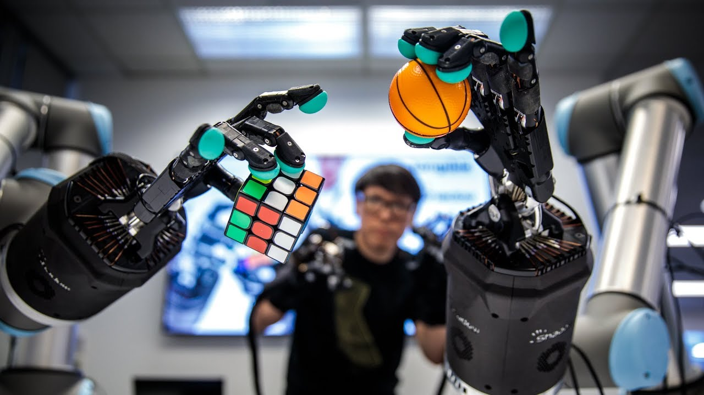

# Dutor Grant 2022 - Low cost robot anthropomorphic hand

This website will host all the knowledge and learnings from the project "Desarrollo de una mano robótica antropomórfica de bajo coste y un guante de control"
I will be mixing english and spanish because the proposal of the project was written in spanish.

- [Proposal](./proposal/index.md)
- [State of the art](./state-of-the-art/index.md)
- [Development of prototypes](./prototypes/index.md)
- [Evaluation](./evaluation/index.md)

