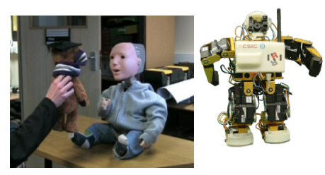
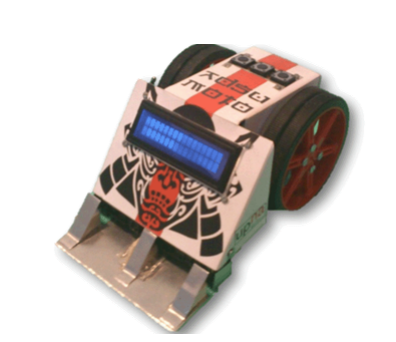

# Idoneidad del candidato

Para poder desarrollar este proyecto son necesarios conocimientos de robótica y de inteligencia artificial. A continuación resumo mi experiencia en ambos ámbitos, para información más detallada se puede acceder a mi [perfil de Linkedin](https://es.linkedin.com/in/guillermobarbadillo)

## Robótica

Estudié Ingeniería Industrial con especialidad en Electrónica y durante la carrera hice prácticas en los laboratorios de robótica del [Instituto de Robótica e Informática Industrial](https://digital.csic.es/handle/10261/30067) del CSIC y en la [universidad de Hertfordshire](https://uhra.herts.ac.uk/handle/2299/6381) al norte de Londres.  Concretamente estuve desarrollando aplicaciones de sensores de presión para un pie robótico y para un robot humanoide llamado Kaspar diseñado para ayudar a niños con autismo.

En el proyecto final de carrera diseñé y construí el robot de sumo [Adsumoto](https://www.youtube.com/watch?v=ClTWrSS48wY). Finalmente en los primeros años de mi carrera profesional estuve trabajando en el diseño de dispositivos electrónicos en la empresa das-Nano. Como parte de ese trabajo realicé el proyecto “Diseño de un Dispositivo para Administración Controlada de Medicamentos mediante Nanotecnología” con la beca Fuentes Dutor en el año 2013.

<!--  -->

<iframe width="1280" height="500" src="https://www.youtube.com/embed/ClTWrSS48wY" title="YouTube video player" frameborder="0" allow="accelerometer; autoplay; clipboard-write; encrypted-media; gyroscope; picture-in-picture" allowfullscreen></iframe>

## Inteligencia artificial

Desde el año 2014 llevo trabajando en distintos proyectos de inteligencia artificial (IA). Trabajé en la empresa das-Nano en el desarrollo de Lynx, una contadora de billetes óptica sin contacto que usaba IA para detectar y contar los billetes. También trabajé en el proyecto [dasFood](https://www.youtube.com/watch?v=auo7TVEyaNs) que permitía el cobro automático del menú en el restaurante de La Vela del BBVA.

En los últimos años he estado desarrollando un motor de biometría de voz en la empresa Veridas y actualmente tengo el rol de AI Research Lead donde estoy ayudando al desarrollo de los motores de biometría facial y voz y a los motores de verificación documental.

Pero la IA no se limita solo a mi trabajo sino que es también mi hobby y en mi tiempo libre sigo aprendiendo más de esta disciplina y he participado en muchos concursos de IA. He obtenido premios en los siguientes concursos (todos ellos internacionales y con importantes premios económicos):

- 1º posición en DSTL's Safe Passage, donde había que analizar imágenes de satélite
- 1º posición en [Schneider's "Power Laws: Cold Start Energy Forecasting"](https://www.drivendata.org/competitions/55/schneider-cold-start/)
- 2º posición en [Animal-AI Olympics](http://animalaiolympics.com/AAI/)
- 2º posición en [Schneider's "Power Laws: Optimizing Demand-side Strategies"](https://www.drivendata.org/competitions/53/optimize-photovoltaic-battery/)
- 5º posición en [Lux AI Challenge](https://www.lux-ai.org/)
