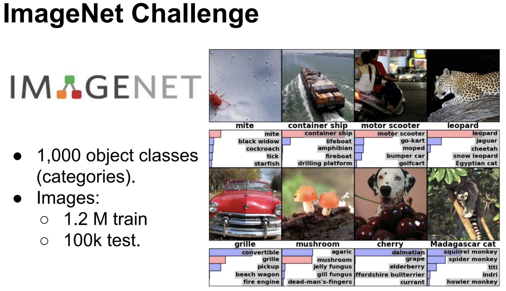

# Estado actual de la inteligencia artificial

El campo de la inteligencia artificial (IA) ha experimentado un gran progreso en la última década. La revolución del Deep Learning ha propiciado que a día de hoy los ordenadores puedan realizar tareas que hasta hace muy poco solo estaban al alcance de los humanos.

El Deep Learning funciona muy bien cuando tenemos grandes bases de datos etiquetadas. Por ejemplo [Imagenet](https://image-net.org/) es una base de datos de millones de imágenes donde cada imagen está etiquetada con los elementos que contiene: por ejemplo perro, coche… Utilizando esta base de datos podemos entrenar modelos que reconozcan el contenido de nuevas imágenes.

De la misma forma los asistentes de voz como Siri o Alexa se entrenan con enormes bases de datos de audios y sus transcripciones. Así cuando les hablamos, pueden transcribir automáticamente lo que hemos dicho y realizar acciones en consecuencia.

También ha habido grandes avances en el área del aprendizaje por refuerzo: en el que la IA es capaz de aprender por sí misma a base de prueba y error. Un hito importante fue el desarrollo de [AlphaGo](https://www.deepmind.com/research/highlighted-research/alphago) por parte de la empresa DeepMind que consiguió vencer al campeón del mundo de Go en 2016. AlphaGo fue capaz de aprender a jugar al Go de manera sobrehumana jugando contra sí misma.

Este enfoque de aprendizaje por refuerzo se está intentando llevar al mundo de la robótica. Por ejemplo la empresa [OpenAI](https://openai.com/blog/solving-rubiks-cube/) fue capaz de entrenar a una mano robótica para resolver el cubo de rubik. Sin embargo este enfoque tiene un problema importante ya que aprender desde cero requiere mucho tiempo y una capacidad de cómputo muy grande, lo que se traduce en un coste muy alto.
