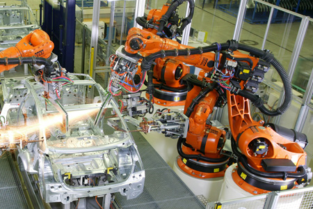
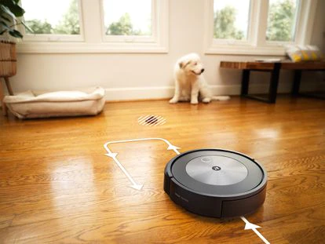
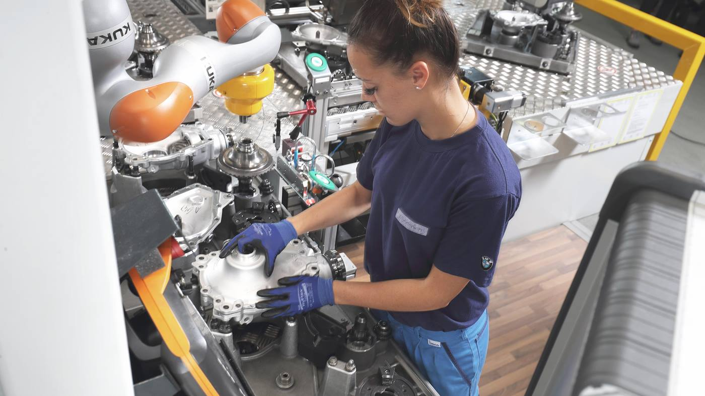
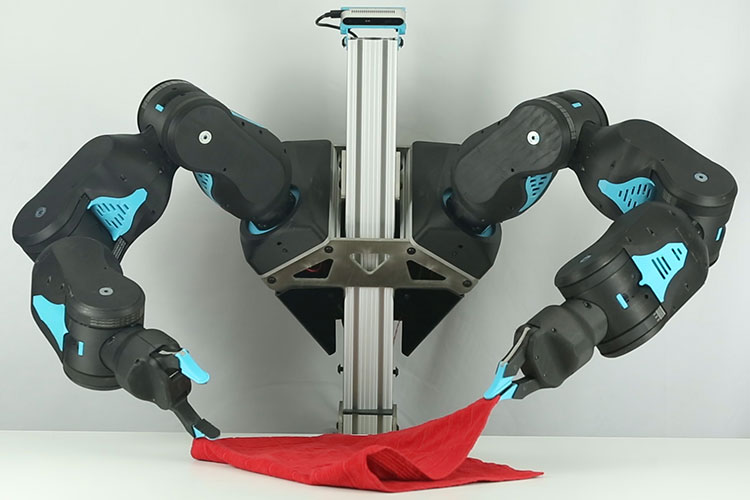

# Estado actual de la robótica

La ciencia ficción lleva más de 50 años prometiéndonos un futuro de robots humanoides que realizarán las tareas rutinarias y nos permitirán dedicarnos a lo que nos apetezca: viajar, investigar, el arte…

Sin embargo nos encontramos ante una realidad muy distinta. Hay entornos como la fabricación de automóviles que están muy robotizados pero sin embargo siguen requiriendo mucha mano de obra en la cadena de montaje.

Estos robots no son nada inteligentes: se limitan a repetir los movimientos para los que han sido programados con una gran exactitud. Son muy útiles en tareas de soldadura o en mover piezas muy pesadas pero cuando hay que hacer tareas más delicadas como montar los componentes del interior del coche es necesario que lo hagamos los humanos.

Por otro lado, en los últimos años hemos empezado a ver robots aspiradores que funcionan muy bien y ahorran tiempo en la limpieza del hogar. Pero su utilidad se limita a la limpieza del suelo. Si queremos limpiar el baño, hacer la comida… tenemos que hacerlo los humanos.

También es necesario reseñar el reciente desarrollo de los cobots. Estos son robots más ligeros que los usados en automoción y pueden operar en entornos no controlados (por el contrario los robots de automoción deben estar enjaulados para evitar dañar a las personas). Los cobots pueden detectar si han chocado contra una persona y detenerse por lo que son mucho más seguros que los robots tradicionales. Sin embargo adolecen del mismo defecto: se limitan a repetir movimientos

Los avances en visión artificial han permitido dotar de cierta inteligencia a los cobots de tal manera que pueden detectar dinámicamente dónde están los objetos en lugar de limitarse a seguir una trayectoria fija. Pero las operaciones que pueden realizar están muy limitadas porque las manos robóticas son muy simples comparadas con las humanas.

El futuro que se nos prometió todavía no ha llegado. Los humanos todavía tenemos que hacer tareas repetitivas y poco gratificantes a diario en nuestras casas o en el trabajo. Los robots humanoides que puedan hacer nuestro trabajo siguen siendo ciencia ficción.
